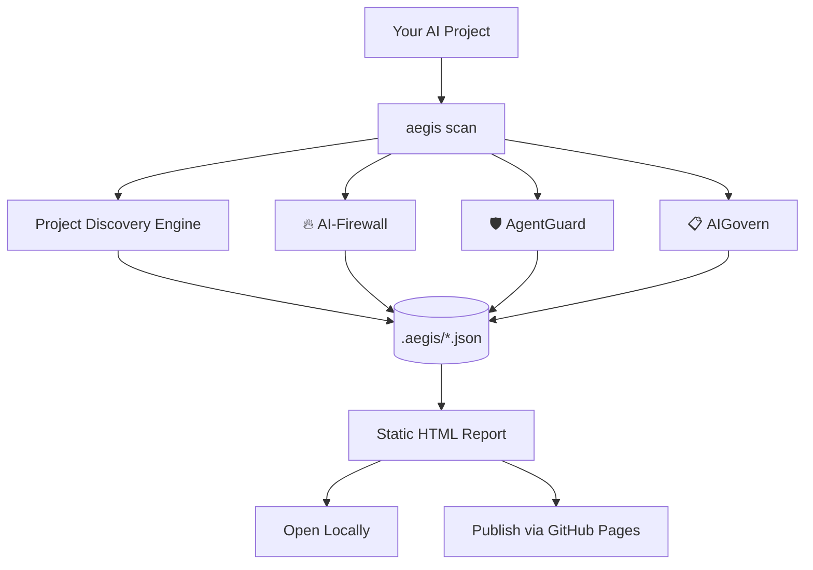

<div align="center">

# 🛡️ SYJ-AEGIS

### Open-Source AI Agent Security & Governance Engine


[](./LICENSE)


**What can this AI system access, what can it do, what risks does it introduce, and is it ready for production?**

</div>

---

## 📑 Table of Contents

- [Why SYJ-Aegis Exists](#-why-syj-aegis-exists)
- [What It Solves](#-what-it-solves)
- [How It Works](#️-how-it-works)
- [Installation](#-installation)
- [Quick Start](#-quick-start)
- [Example Output](#-example-output)
- [Development Roadmap](#-development-roadmap)
- [Design Philosophy](#-design-philosophy)
- [Repository Structure](#️-repository-structure)
- [Testing](#-testing)
- [Contributing](#-contributing)
- [License](#-license)
- [Disclaimer](#️-disclaimer)

---

## 🎯 Why SYJ-Aegis Exists

AI agents don't just answer questions anymore — they're wired directly into shells, databases, filesystems, Git repos, vector stores, and internal company systems. Every one of those wires is a new security boundary, and most teams shipping agents today have no structured way to answer basic questions about it:

- What tools can this agent actually call?
- What permissions do those tools carry — read, write, execute, network, destructive?
- Is user input reaching a privileged prompt unchecked?
- Could retrieved RAG content cross an authorization boundary nobody thought about?
- Is a hardcoded API key sitting in a prompt template right now?

Most existing AI security tooling either requires uploading your source code to someone else's cloud, or bolts a dozen third-party dependencies onto your project just to run a scan. SYJ-Aegis takes the opposite approach: it's a **local-first, dependency-free, static analysis engine** you can run from a single Python standard-library install — including directly on a phone via Termux — that never sends your code anywhere.

## 🧩 What It Solves

| Problem | SYJ-Aegis Module |
|---|---|
| Hardcoded secrets in code, config, and prompt templates | 🔥 **AI-Firewall** — Secret Detection |
| Untrusted input reaching privileged LLM prompts | 🔥 **AI-Firewall** — Prompt Security |
| RAG pipelines with no visible authorization boundary | 🔥 **AI-Firewall** — RAG Security |
| Model output flowing straight into a shell or SQL call | 🔥 **AI-Firewall** — Output Security |
| No visibility into what tools an agent can call, or with what permissions | 🛡️ **AgentGuard** — Tool Inventory & Permission Model |
| Agents accumulating dangerous permission combinations unnoticed | 🛡️ **AgentGuard** — Excessive Agency Detection |
| No inventory of what AI systems exist across a codebase, or who owns them | 📋 **AIGovern** — AI System Register & Risk Register |

## 🏗️ How It Works



Everything the engine finds carries **evidence** — a real file path and line number — and a **confidence level**, so nothing in the report is asserted more strongly than static analysis can actually support.

## 📦 Installation

### Termux (Android / ARM64) — primary target

```bash
pkg update && pkg install python git -y

git clone https://github.com/SHalimoosavi/SYJ-Aegis.git
cd SYJ-Aegis

python -m venv .venv
source .venv/bin/activate

pip install -e .

aegis --help
```

### Linux / macOS

```bash
git clone https://github.com/SHalimoosavi/SYJ-Aegis.git
cd SYJ-Aegis

python3 -m venv .venv
source .venv/bin/activate

pip install -e .

aegis --help
```

No compiled extensions, no native build tools, no internet access required after cloning — the scanner itself is pure Python standard library.

## 🚀 Quick Start

```bash
# Scan a project
aegis scan ./my-ai-agent

# Check version
aegis version

# See all commands
aegis --help
```

A scan produces a `.aegis/` directory in the target project containing machine-readable JSON findings plus a self-contained, static HTML report you can open directly in a browser or publish via GitHub Pages — no backend required.

> Some CLI subcommands described in the full specification (`aegis inventory`, `aegis agents`, `aegis secrets`, `aegis report`, `aegis rules list`) are on the roadmap below and may not all be wired up yet depending on which phase is currently merged — check `aegis --help` in your checkout for the authoritative, current list.

## 📊 Example Output

Illustrative shape of a finding (see your generated `findings.json` for the exact current schema):

```json
{
  "id": "AEGIS-AI-001",
  "category": "prompt_security",
  "severity": "HIGH",
  "confidence": "MEDIUM",
  "file": "agents/customer_agent.py",
  "line": 42,
  "description": "Untrusted user-controlled content is incorporated into a privileged instruction path.",
  "recommendation": "Separate trusted instructions from untrusted content and apply explicit trust-boundary handling."
}
```

## 🔥 Phase 3 — AI-Firewall

Phase 3 adds conservative, evidence-backed static checks for AI-specific security boundaries without attempting runtime or cross-function data-flow analysis. The scanner remains standard-library-only, local-first, deterministic, and non-executing.

Implemented on the `phase-3-ai-firewall` branch:

- Hardcoded secrets in string literals assigned to prompt/instruction/system-like variables.
- Prompt-injection exposure where request/function-parameter input is directly incorporated into an LLM prompt within the same function.
- Direct PII-like data exposure to logging, LLM, or network sinks.
- Vector-store/RAG detection with authorization-filter review for retrieval calls. Unverified access filtering is reported as `UNCLEAR` / `REVIEW REQUIRED` rather than as a confirmed isolation failure.
- LLM output flowing into dangerous execution, SQL, or filesystem sinks within the same function.
- Phase 3 findings use the `AEGIS-AI-0xx` rule namespace and the existing Finding model.

Phase 3 intentionally does not perform cross-function or cross-file taint tracking. Cases that cannot be resolved by direct same-function evidence are not promoted to false certainty.

## 🧭 Development Roadmap

| Phase | Module | Scope | Status |
|:---:|---|---|:---:|
| 1 | Core Scanner | Project discovery, secret detection, JSON + HTML reporting | ✅ Merged |
| 2 | 🛡️ AgentGuard | Tool inventory, permission model, excessive-agency detection | ✅ Merged |
| 3 | 🔥 AI-Firewall | Prompt security, data exposure, RAG security, output security | ✅ Merged |
| 4 | 📊 GitHub Pages Dashboard | Self-scan dashboard, live severity summary, module status, static report publishing | 🚧 In Progress |
| 5 | 📋 AIGovern | AI system register, data map, risk register | 📋 Planned |
| 6 | Production Hardening | CI/CD mode, SARIF output, baselines, suppressions, full docs, GitHub Actions | 📋 Planned |

Each phase is built and merged independently on its own branch, with full test coverage, before the next begins.

## 🔐 Design Philosophy

> *Scan locally. Understand completely. Report transparently. Remediate safely.*

- **Local-first.** Source code, secrets, and prompts are never transmitted anywhere. Any future optional external intelligence feature will be explicitly opt-in and off by default.
- **Zero runtime dependencies.** Python standard library only — auditable, and installable anywhere Python runs, including Termux on ARM64.
- **Evidence-first.** Every finding traces back to a real file and line. No finding without evidence.
- **Confidence over false certainty.** Static analysis can't prove runtime behavior — the engine says "these observable risks were detected," never "this system is secure."
- **No fabricated governance data.** Where something can't be determined automatically, the output says `UNKNOWN` rather than guessing.

## 🗂️ Repository Structure

```
SYJ-Aegis/
├── aegis/
│   ├── cli/          # Command-line interface
│   ├── core/          # Scan orchestration
│   ├── analyzers/      # Per-language static analyzers
│   ├── rules/          # Detection rules
│   ├── engine/         # Rule engine
│   ├── inventory/       # Tool & AI-system inventory
│   ├── agents/         # AgentGuard
│   ├── governance/      # AIGovern
│   ├── reporting/       # JSON + HTML report generation
│   └── security/        # Scanner-hardening (path traversal, resource limits, etc.)
├── tests/
│   ├── unit/
│   ├── integration/
│   └── fixtures/
├── rules/
├── docs/
├── examples/
├── pyproject.toml
└── README.md
```

## 🧪 Testing

```bash
python -m unittest discover -s tests -v
```

All detection rules ship with both positive and negative fixtures, and the full findings output is verified to be byte-for-byte deterministic across identical runs.

## 🤝 Contributing

Issues and pull requests are welcome. Before submitting a new detection rule, please include:

- A rule ID following the `AEGIS-<CATEGORY>-<NUMBER>` convention
- Positive and negative test fixtures
- A remediation description

See `CONTRIBUTING.md` for the full guidelines.

## 📄 License

Released under the [MIT License](./LICENSE) — adjust this section if a different license file is actually in the repo.

## ⚠️ Disclaimer

SYJ-Aegis performs **static analysis only**. It does not execute your code, and it cannot verify runtime behavior. A clean scan is not proof that a system is secure — it means no findings were detected by the rules currently implemented. Always pair automated scanning with human security review.

---

<div align="center">
Built for developers who want to know what their AI agents can actually do — before production finds out for them.
</div>
